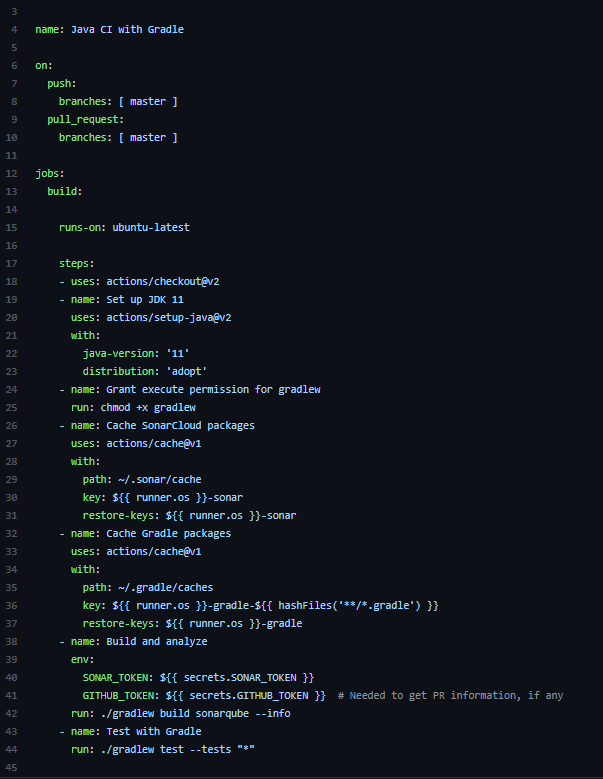

## Gradle build keretrendszer és CI beüzemelése
--- 

- A __Gradle__ már alapból bevolt üzemelve a projectnél.

- A CI-hez __GitHub actions__ választottunk.

Ahhoz, hogy ezeket végre tudjuk hajtani egy __build.gradle__ file-ra. Valamint a __GitHub Actions__ működéséhez egy _gradle.yml_ file-t is létre kellett hozni.

Látható, hogy minden egyes master-ágon végrejatott push-nál illetve pull request-eknél lefut a pipeline megpróbálja buildelni az alkalmazást és a testeket is lefuttatja.