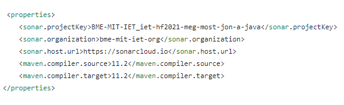
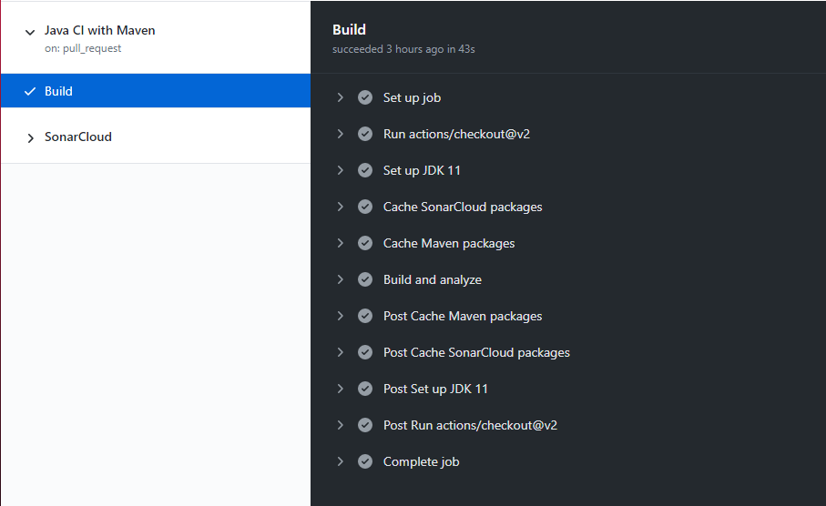
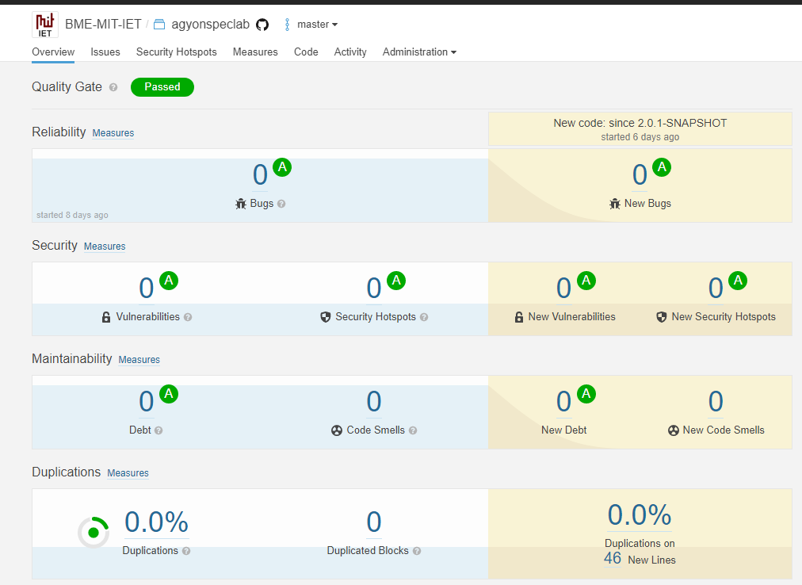

## CI build

- Github Actions segítségével létrehoztuk a mavenes CI buildet és beépítettük a SonarCloud szolgáltatást.
  - Ehhez megváltoztattuk a pom.xml fájlt:
  
    
  
- Ezáltal minden egyes pull-request-nél mielőtt mergeljük a master ágra lebuildeli a beküldött kódot.

  - Előnye, hogy így ellenőrizni tudjuk, hogy valóban működik és nem pusholunk olyan kódot master ágra ami eltöri a rendszert.

- A buildben lévő lépések:

  

  SonarCloud:

  

  

