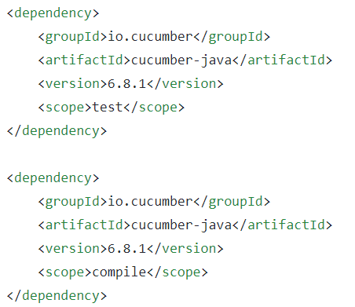
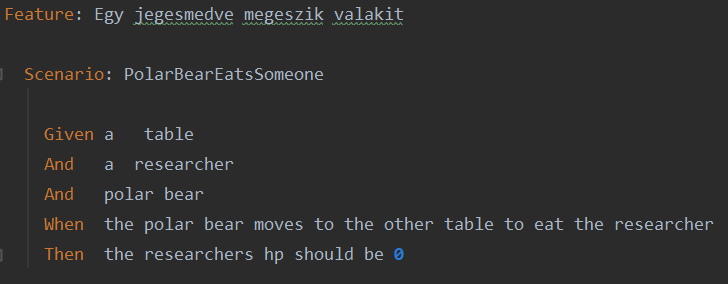
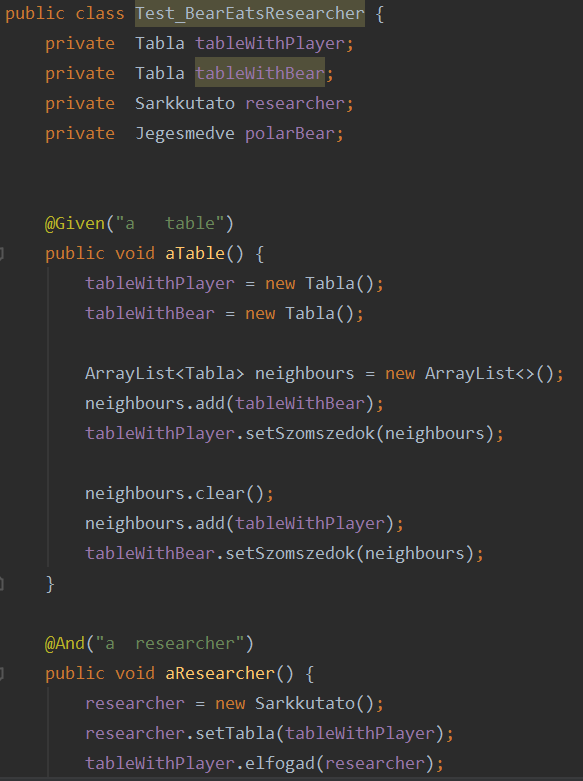
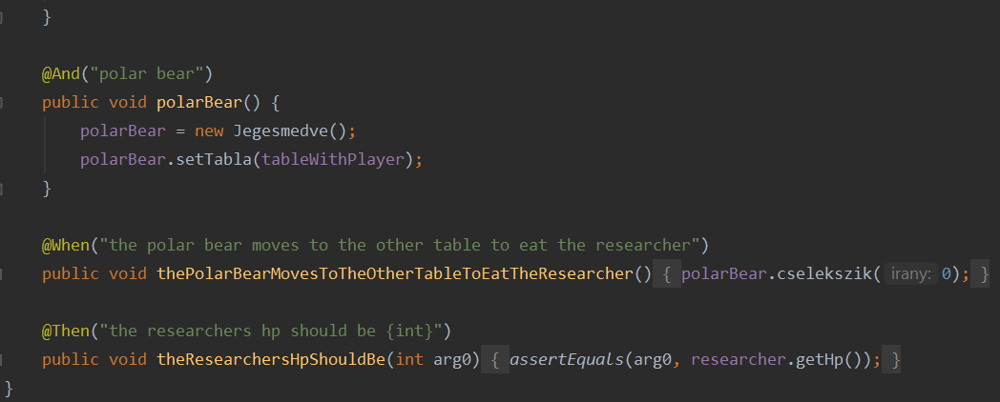
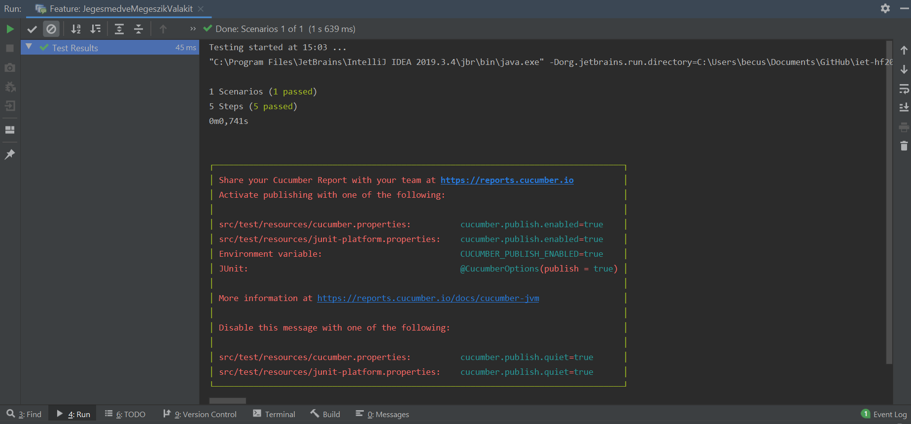

## BDD tesztek készítése

A Cucumber egy viselkedésvezérelt fejlesztési keretrendszer (Behavior Driven Development), melynek segítségével elfogadási teszteket írhatunk.

- A keretrendszer használatához az alábbiakra van szükségünk:
    - Java SE
    - Egy build eszköz:
        - Maven (leglább 3.3.1-es verzió)
        - Gradle
    - Egy fejlesztőkörnyezet:
        - Intellij IDEA
        - Eclipse

- Következő lépésben a meglévő projektünkbe kell felvennünk a pom.xml fájl bővítésével:

    

    A importálás során fontos megjegyezni, hogy a verziószámoknak meg kell egyezniük.

- Ezek után elkészíthetjük tesztjeinket:
    - A tesztek során konkrét példákat/scenario-kat írunk, hogy mit várunk a folyamat futásától a végrehajtás közben és annak eredményét is meghatározva
    - Ezen scenario-k a .feature fájlban vannak definiálva
    
- Példa a scenario-ra:

    

    - A fájl első sora egy kulcsszóval kezdődik (Feature), melyet egy név követ.
    - A következő a már említett scenario, mely egy konkrét példa, amely illusztrálja, hogyan kellene a tesztnek lefutnia.
    - Az utolsó sorok tartalmazzák a Given, When, Then kulcsszavakat, ezek a scenario lépései, melyeket a Cucumber lefuttat.

- Végül, de nem utolsó sorban definiálnunk kell a fentebb leírt lépéseket: 

    
    

- Ezek után futtathatjuk, melynek eredményéről a képhez hasonlóan visszejelzést kell kapnunk:

    

    - Láthathjuk, hogy sikeresen lefutott és elfogadásra került

    