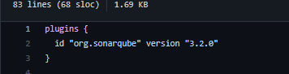
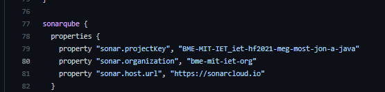
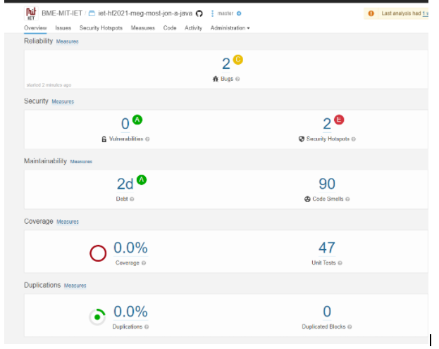
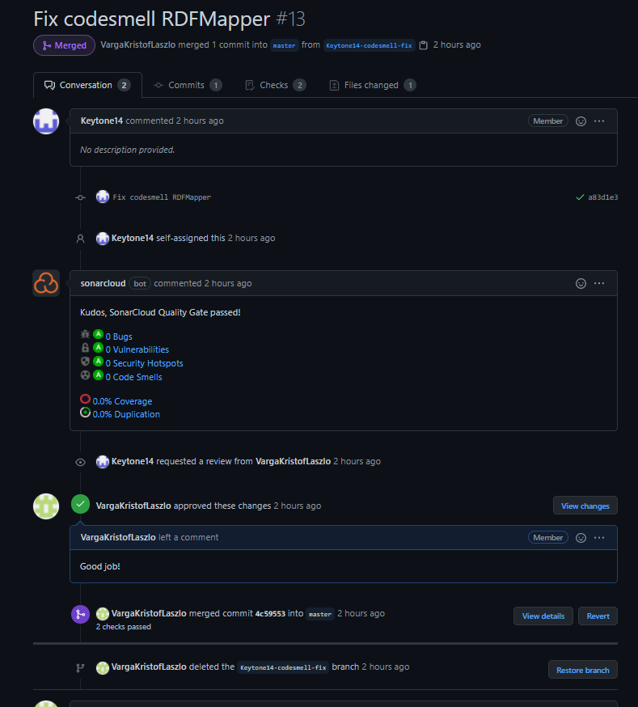
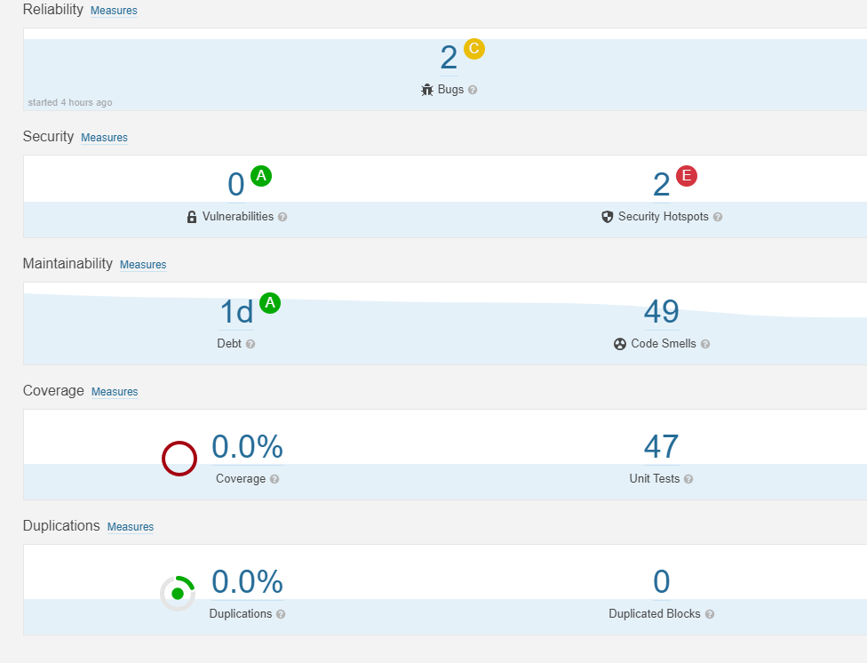

## Statikus analízis _SonarCloud_ használatával.

A codesmelleket __SonarCloud__ segítségével kerestük meg és kezdtük el javítani. Annak érdekében, hogy CI pipleline-unk letudja futtatni a sonar-os ellenőrzést szükségünk volt a _build.gradle_ file módosítására.

Ezen kívül a gradle.yml file-t is módosítani kellett, hogy a CI pipeline része legyen a sonarqube-os teszt.

---

## Amikor először vizsgáltuk meg a sonar cloud visszajelzéseit akkor a következőt láttuk:

A code smell-eket kezdtük el javítani a következő két file-ból:

__RDFMapper.java__ és __RDFMapperTests.java__.

---

A hibák egy részét szétosztottuk magunk között és pull request-eken keresztül javítottuk ki őket. Minden egyes pull request-ünk után lefutott a már beállított CI pipeline és ha minden sikeres volt akkor egy code review-t kértünk egy társunktól.

---
Az analízis segítségével képesek voltunk a code smelleket kb a felére csökkenteni.

